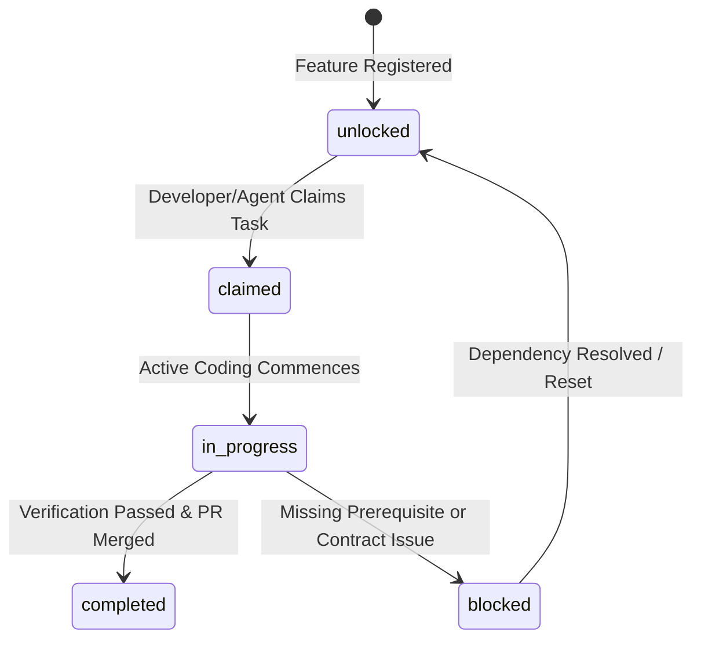

# Governance & Concurrency Rulebook — Adwa Lens

This document defines the automated governance, state locking protocols, directory ownership boundaries, and contract safety rules for human developers and autonomous AI agents (Antigravity, Cursor, Windsurf) working in this repository.

---

## 1. Core Principles of Multi-Agent Concurrency

1. **Zero Collision Architecture**: Every file in `frontend/src/components/screens/`, `backend/routes/`, and `frontend/public/` is owned by exactly one stream.
2. **State Locking Protocol**: Tasks are claimed, tracked, and locked via `feature_lock.json` in the root directory. Agents and developers must update state locks in real time.
3. **Immutable Shared Interfaces**: Shared contracts (`public/exhibits/*.json`, Zustand store schemas, Fastify BFF route shapes) cannot be mutated without a contract version bump and log entry in `docs/CHANGELOG_CONTRACTS.md`.
4. **Hero Demo Path Guarantee**: The primary hackathon judging path (*Landing → Itinerary Planner → Live Navigation → Camera Scan Shotel → 3D Inspection Hub → Voice Q&A → Sensory Hub drum tap → Memory Deck*) must remain functional at all times.

---

## 2. Directory & Component Ownership Matrix

```
Adwa Lens Root/
├── backend/
│   ├── routes/
│   │   ├── vision-scan.js   [Stream B]
│   │   ├── stt.js           [Stream B]
│   │   ├── ask-guide.js     [Stream B]
│   │   └── tts-stream.js    [Stream B]
│   └── lib/
│       ├── errors.js        [Stream B / Core]
│       └── personas.js      [Stream B]
├── frontend/
│   ├── public/
│   │   ├── exhibits/        [Stream A (hotspots/models) & Stream B (facts)]
│   │   └── models/          [Stream A]
│   └── src/
│       ├── components/
│       │   ├── screens/
│       │   │   ├── Landing.jsx            [Stream C]
│       │   │   ├── ItineraryPlanner.jsx   [Stream C]
│       │   │   ├── LiveNavigation.jsx     [Stream C]
│       │   │   ├── CameraScanner.jsx      [Stream B]
│       │   │   ├── InspectionHub.jsx      [Stream A]
│       │   │   ├── SensoryHub.jsx         [Stream A (3D) / Stream D (Audio)]
│       │   │   ├── VoiceGuideOverlay.jsx  [Stream B]
│       │   │   └── MemoryDeck.jsx         [Stream C / Stream D]
│       │   └── ui/                        [Stream C]
│       ├── hooks/
│       │   ├── useCameraScanner.js        [Stream B]
│       │   ├── useVoiceGuide.js           [Stream B]
│       │   └── useNetworkStatus.js        [Stream C / Core]
│       ├── lib/
│       │   ├── pitchDetection.js          [Stream D]
│       │   └── haptics.js                 [Stream D]
│       └── stores/
│           ├── useSessionStore.js         [Stream C / Core]
│           └── useExhibitStore.js         [Stream A / Stream B]
├── docs/
│   ├── ARCHITECTURE.md                    [Architectural Blueprint]
│   ├── adwa_lens_architecture.md          [Complete Data Flow & Specs]
│   ├── PHASES_AND_ROLES.md                [Stream Phase Ownership]
│   ├── AGENT_INSTRUCTIONS.md              [AI Agent Directives]
│   ├── CHANGELOG_CONTRACTS.md             [Shared Contract Log]
│   └── GOVERNANCE.md                      [Governance Rulebook (This File)]
└── feature_lock.json                      [Central State Lock File]
```

---

## 3. Feature Lock State Machine (`feature_lock.json`)

All tasks in `feature_lock.json` follow strict state transitions:



### State Definitions & Rules:
- **`unlocked`**: Task is open for assignment. Any stream owner may claim it if prerequisite `dependencies` are `completed`.
- **`claimed`**: Agent/Developer sets `"status": "claimed"`, `"claimed_by": "<Agent-ID>"`, `"claimed_at": "<ISO-Timestamp>"`.
- **`in_progress`**: Task execution is actively underway. Only 1 active task per agent at any given time.
- **`blocked`**: Work is suspended due to an unmet dependency or upstream bug. Reason must be documented in commit log.
- **`completed`**: Verification criteria validated, `npm run lint` clean, and deliverables written.

---

## 4. Full Exhibit Catalog & Interactive Mechanics Mapping

The system supports 5 explicit exhibits across Streams A, B, C, and D:

### Exhibit Roster & Ownership
1. **Shotel Sword (`shotel_sword`)** — Hero Artifact
   - **Deliverables**: `public/models/shotel_sword.glb`, `public/exhibits/shotel_sword.json`
   - **Stream A**: Curved blade, hilt, sheath 3D mesh, hotspots, exploded view transform.
   - **Stream B**: RAG persona facts (blade curvature tactical usage, iron metallurgy).
   - **Stream D**: Blade swipe gesture metallic clash sound & particle canvas burst.

2. **Emperor Menelik II & Empress Taytu Monument (`menelik_taytu_statue`)**
   - **Deliverables**: `public/models/menelik_taytu_statue.glb`, `public/exhibits/menelik_taytu_statue.json`
   - **Stream A**: Statue 3D mesh, hotspots for Velvet Kaba (Robe), Crown, Weaponry, and Empress Taytu Banner.
   - **Stream B**: Royal & Scholar persona RAG scripts detailing Battle of Adwa leadership & diplomacy.

3. **Negarit Ceremonial Royal Drum (`negarit_drum`)**
   - **Deliverables**: `public/models/negarit_drum.glb`, `public/exhibits/negarit_drum.json`
   - **Stream A**: Drum 3D mesh, hide skin, leather tension rope, and wooden base hotspots.
   - **Stream B**: Historical war proclamation & royal ceremonial RAG facts.
   - **Stream D Interactions**:
     - **Direct Mesh Tap**: Raycasting on drum hide mesh surface triggers Web Audio synth drum-tap instantly.
     - **Strike UI Button**: Visible overlay control tapping virtual mallet.
     - **Haptics**: `navigator.vibrate()` pulse + visual audio-wave canvas pulse.

4. **Embilta Ceremonial Wind Instrument (`embilta`)**
   - **Deliverables**: `public/models/embilta.glb`, `public/exhibits/embilta.json`
   - **Stream A**: Bamboo/metal flute 3D mesh, blowhole & acoustic chamber hotspots.
   - **Stream B**: Traditional single-note acoustic & ceremonial RAG facts.
   - **Stream D Interactions**:
     - **Mic Blow Trigger**: Mic input autocorrelation pitch/amplitude detection in `pitchDetection.js`.
     - **Blow / Play Sound Button**: Interactive UI button playing single-note tone.
     - **Visual Airflow Overlay**: Glowing particle airflow shader inside 3D mesh.

5. **Meleket Royal Trumpet (`meleket`)**
   - **Deliverables**: `public/models/meleket.glb`, `public/exhibits/meleket.json`
   - **Stream A**: Long ceremonial horn 3D mesh, mouth opening & bell flare hotspots.
   - **Stream B**: Military mobilization & royal proclamation RAG facts.
   - **Stream D Interactions**:
     - **Mic Blow Trigger**: Volume/amplitude detection mapping breath to synthesized trumpet call.
     - **Blow Button**: Interactive UI button playing ceremonial trumpet call.
     - **Visual Airflow Overlay**: Airflow particle burst overlay through horn bell flare.

---

## 5. Contract Change & Versioning Protocol

Whenever a shared interface is modified:
1. **Check `docs/CHANGELOG_CONTRACTS.md`** for existing changes.
2. **Append a new entry** using the required log format:
   ```markdown
   ### YYYY-MM-DD — <short description>
   Stream: <A|B|C|D>
   Changed: <file(s)>
   Reason: <why>
   Migration: <what other streams need to do>
   ```
3. **Do not break existing exports**: Add new fields or functions with backward compatibility; mark old exports with deprecation notices.

---

## 6. Pre-Commit Verification Checklist

Before marking any task `completed` in `feature_lock.json` or completing a turn:
- [ ] Code passes `npm run lint` without errors.
- [ ] All changes are contained within the assigned stream's directory ownership.
- [ ] Shared contract changes are logged in `docs/CHANGELOG_CONTRACTS.md`.
- [ ] `feature_lock.json` status updated for claimed feature.
- [ ] Graceful fallback handling implemented for all AI external calls.
- [ ] Design tokens from `tailwind.config.js` used (no raw hex colors).
- [ ] End-to-end hero demo path validated.
